# Introduction to Monitoring Infrastructure in AWS


Monitoring infrastructure in AWS using CloudWatch and CloudTrail is essential for maintaining the security and performance of your cloud resources. Here's a brief introduction:

**Amazon CloudWatch** is a monitoring service that provides data and actionable insights to monitor your AWS resources. With CloudWatch, you can collect and track metrics, set alarms, and automatically react to changes in your AWS resources. It allows you to gain system-wide visibility into resource utilization, application performance, and operational health².

**AWS CloudTrail** is a service that enables governance, compliance, operational auditing, and risk auditing of your AWS account. It records actions taken by a user, role, or an AWS service and delivers log files to you. The recorded information includes the identity of the API caller, the time of the API call, the source IP address of the API caller, the request parameters, and the response elements returned by the AWS service¹.

Together, these services provide a comprehensive view of your AWS environment, allowing you to detect unusual activity, set alarms for specific events, and maintain a robust security posture.


In this project we will Learn to effectively monitor your AWS infrastructure using CloudWatch and Cloud Trail, gaining insights into system performance, security, and operational health.


# Monitoring Infrastructure in AWS (Cloudwatch, Cloud trail)

To understand the importance of cloudwatch and cloud trail, let us picture this scenario: Your startup has just rolled out its latest application on Amazon Web Services (AWS). As excitement mounts, traffic begins to pour in as users engage with your offering. Yet, with this surge in success comes a new set of responsibilities. As your application scales, so does the intricacy of managing its foundational infrastructure. How do you maintain seamless operations? How do you identify and resolve issues before they disrupt user experience? This is where the importance of infrastructure monitoring comes into play. Monitoring involves the continuous observation and gathering of data regarding the performance, health, and behavior of various systems, applications, networks, or infrastructure elements. The core objective of monitoring is to ensure the smooth, efficient, and secure operation of these systems, while promptly detecting and addressing any issues or irregularities that may arise.


# AWS CloudWatch and CloudTrail


---
**AWS CloudWatch** is a monitoring and observability service provided by Amazon Web Services (AWS). It allows users to collect and track metrics, monitor logs, set alarms, and automatically react to changes in AWS resources and applications running on the AWS infrastructure. *CloudWatch* provides insights into the performance, health, and operational status of AWS resources and applications, helping users to troubleshoot issues, optimize resource utilization, and ensure the reliability of their systems. 
---
**AWS Cloud Trail** on the other hand is also a service provided by Amazon Web Services (AWS) that enables governance, compliance, operational auditing, and risk auditing of your AWS account. Cloud Trail records and logs all API activity in your AWS account, providing a comprehensive trail of events that can be used for security analysis, resource change tracking, troubleshooting, and compliance auditing.

# CloudWatch Metrics and Alarms

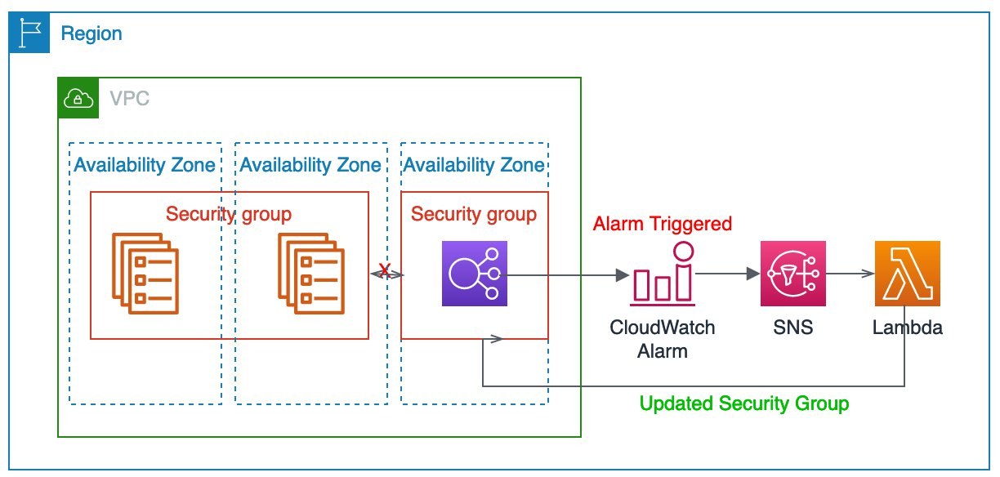

Amazon CloudWatch Metrics and Alarms are essential components of the Amazon CloudWatch service, which provides monitoring and observability capabilities for AWS resources and applications. Let's delve into each of these components:

# CloudWatch Metrics

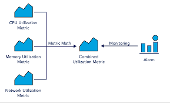

CloudWatch Metrics are data points representing the behavior of AWS resources and applications over time. These metrics can be collected from various AWS services such
as Amazon EC2, Amazon RDS, Amazon S3, AWS Lambda, and many others. Metrics provide insights into the performance, health, and operational status of these resources, allowing users to monitor and analyze their behavior.

.png>)

# Key aspects of CloudWatch Metrics include:

## Default and Custom Metrics: 

AWS services automatically publish default metrics to CloudWatch, such as CPU utilization, network traffic, and disk I/O for EC2 instances. Additionally, users can create custom metrics to monitor specific aspects of their applications or services.

# Namespace and Dimensions: 

Metrics are organized into namespaces, which categorize related metrics together. Within each namespace, metrics can have dimensions that further specify the resource or aspect being monitored. For example, an EC2 instance metric might have dimensions such as Instanceld or instanceType.

# Timestamps and Units: 

Each metric data point includes a timestamp indicating when the measurement was taken, as well as a unit specifying the measurement's scale (e.g., bytes, percentage, seconds).

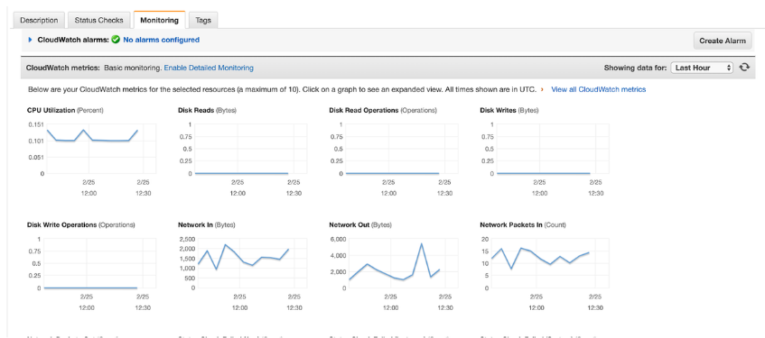


## Retention and Granularity: 

CloudWatch retains metric data for different periods depending on the data's age and granularity. Users can specify the granularity of their metric data, ranging from one-minute to one-day intervals.

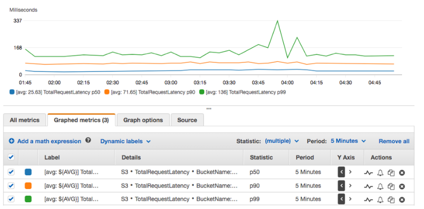


# CloudWatch Alarms:

CloudWatch Alarms allow users to define thresholds on CloudWatch Metrics and trigger actions when these thresholds are breached. Alarms are used to proactively monitor the health and performance of AWS resources and applications, enabling users to respond promptly to changes in their environment.

## Key aspects of CloudWatch Alarms include:

Thresholds and Actions: Users can set thresholds on CloudWatch Metrics, specifying conditions that, when met or exceeded, trigger alarm states. When an alarm enters an alarm state, users can configure actions such as sending notifications via Amazon SNS, executing AWS Lambda functions, or auto-scaling resources.

## Alarm States: 

CloudWatch Alarms have three possible states: OK, INSUFFICIENT_DATA, and ALARM. The OK state indicates that the metric is within the defined threshold, while the ALARM state indicates that the threshold has been breached. The INSUFFICIENT_DATA state occurs when there is not enough data to evaluate the alarm.

## Alarm History: 

CloudWatch maintains a history of alarm state changes, allowing users to track when alarms transition between states and investigate the circumstances surrounding each state change.

## Configuration and Management: 

Users can create, modify, and delete alarms through the CloudWatch Management Console, AWS CLI, or SDKs. Alarms can be managed individually or as part of larger monitoring configurations, such as CloudFormation templates or AWS Auto Scaling policies.

## Monitoring AWS EC2 using CloudWatch

Now that we have an idea of what AWS CloudWatch and CloudTrail is all about, let launch an EC2 instance and monitor it

## Step 1: Create an IAM Role With CloudWatch Full Access and SSMFullAccess

1. Navigate to the IAM console.

2. In the IAM Console navigation click on roles.

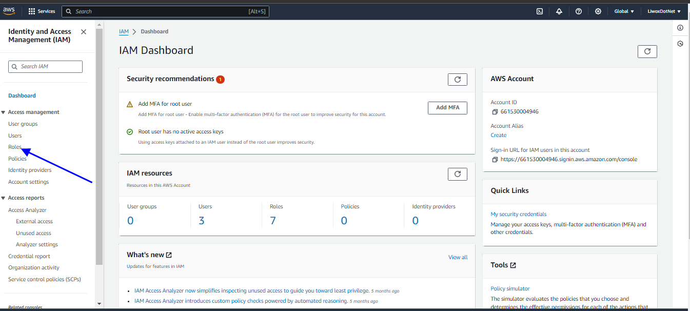


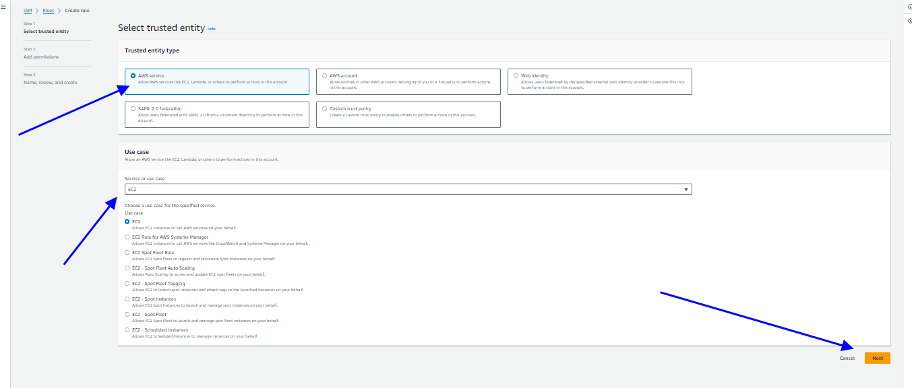


3. Follow the image to create a role with ```CloudWatchFullAccess``` and ```SSMFullAccess``` policy


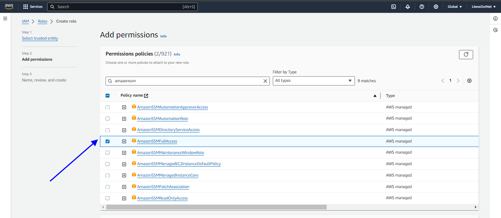

.png>)


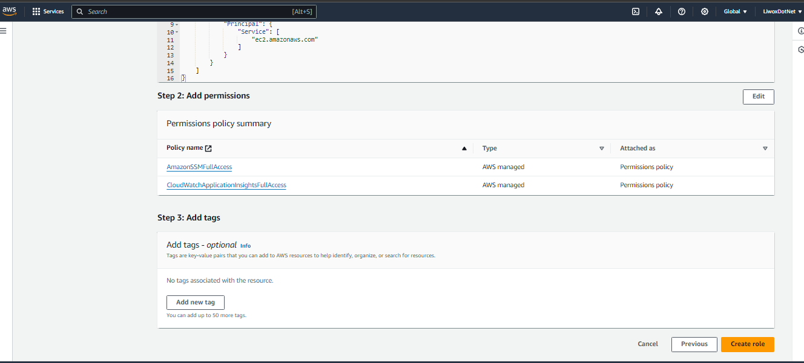


## Create A Parameter In System Manager

Now that we have created an IAM role, we need to create a paramater in the system manager console. By doing this, we will be able to define the metrics we want to monitor for our EC2 instance

1. Navigate to the AWS System Manager Console

2. In the AWS System Manager navigate menu, select parameter store

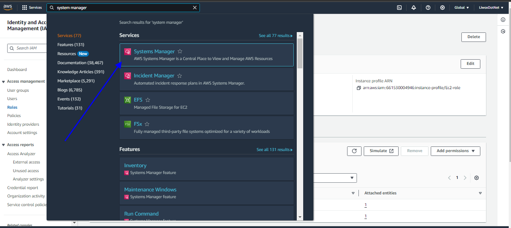


3. Create a new parameter and paste the code snippet below

```
{
	"metrics": {
		"append_dimensions": {
			"InstanceId": "${aws:InstanceId}"
		},
		"metrics_collected": {
			"mem": {
				"measurement": [
					"mem_used_percent"
				],
				"metrics_collection_interval": 180
			},
            "disk": {
				"measurement": [
                     "disk_used_percent"
				],
				"metrics_collection_interval": 180
			}
		}
	}
}

```


The parameters above are a configuration file for the CloudWatch agent, which defines the metrics that will be collected from your EC2 instance and sent to CloudWatch. 

1. "metrics" :

This is the top-level key in the configuration file, indicating that it contains the definitions for the metrics to be collected.

2. "append_dimensions" : 

This section specifies dimensions to be appended to all collected metrics. Dimensions are key-value pairs that help identify the source of the data in CloudWatch. In this case, the dimension "Instanceld" is appended, and its value is populated dynamically with the instance ID of the EC2 instance where the CloudWatch agent is installed.


"InstanceId": "${aws:InstanceId)" : 
This line specifies that the value of the "Instanceld" dimension should be dynamically populated with the instance ID of the EC2 instance.

3. "metrics_collected" : 

This section defines the specific metrics to be collected from the EC2 instance.

"men" This subsection specifies memory-related metrics to be collected.

"measurement" : This is an array of specific memory metrics to collect. In this case, only "nem_used_percent" is specified, which represents the percentage of memory used on the instance.

"metrics_collection_interval" : This parameter specifies how frequently (in seconds) the metrics should be collected. Here, memory metrics will be collected every 60 seconds.

"disk" :This subsection specifies disk-related metrics to be collected.

"measurement" : This is an array of specific disk metrics to collect. Only "disk_used_percent" is specified, representing the percentage of disk space used on the instance.

"metrics_collection_interval" : Similar to the memory section, this parameter specifies how frequently disk metrics will be collected, which is every 60 seconds.

## Create an EC2 Instance, Attach the role created in Step 1

Now that we have created an IAM Role and also created a parameter in the Account System Manager Console, let's create an EC2 instance and that roles we created earlier. But note that SSM will have access to the parameter we created and by attaching the role to the EC2 instance, EC2 will also have access to the parameters

1. Navigate to the EC2 console, select instances. Click on launch instance on the top right

2. Now we will need to launch an Amazon linux 2 instance and attach the role we created in step 1. Follow the images below to attach IAM role to your instance


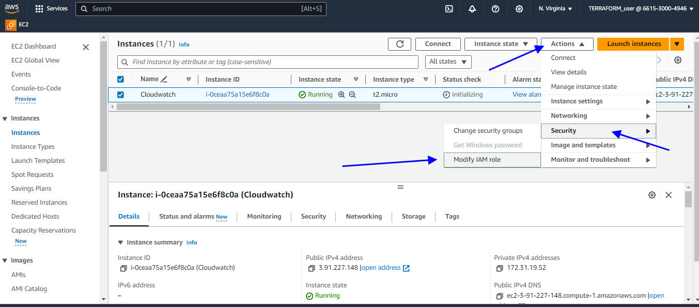


3. Install CloudWatch agent. Create a file name script.sh and past the shell script below.

### Create a file

```
vi script.sh
```
paste the script

```
#!/bin/bash
wget https://s3.amazonaws.com/amazoncloudwatch-agent/linux/amd64/latest/AmazonCloudWatchAgent.zip
unzip AmazonCloudWatchAgent.zip
sudo ./install.sh
sudo /opt/aws/amazon-cloudwatch-agent/bin/amazon-cloudwatch-agent-ctl -a fetch-config -m ec2 -c ssm:/alarm/AWS-CWAgentLinConfig -s

```
make the script executable

```
sudo chmod +x script.sh

```
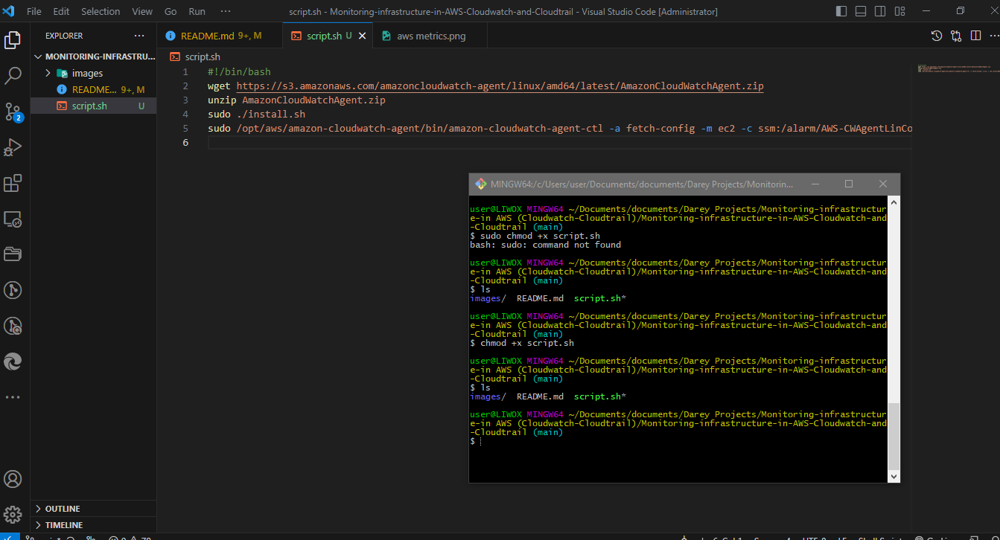

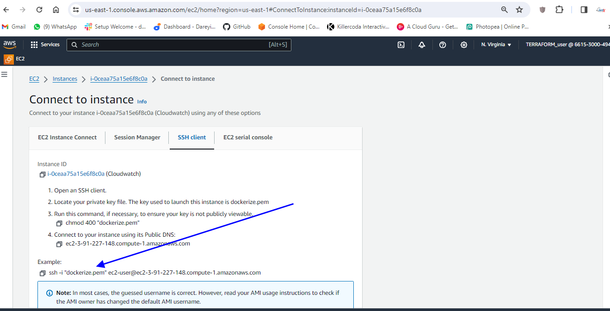


save and run script

```
./script.sh

```
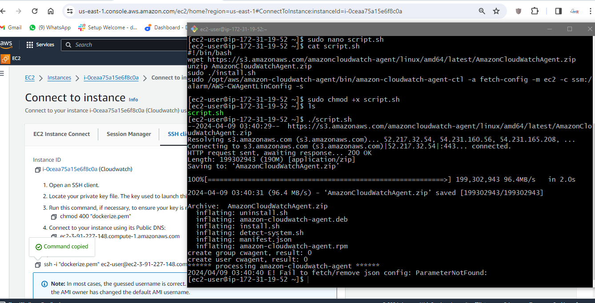

start cloud watch agent

```
 sudo /opt/aws/amazon-cloudwatch-agent/bin/amazon-cloudwatch-agent-ctl -m ec2 -a start

```
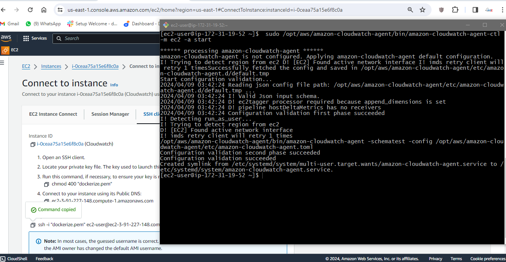

verify if cloudwatch is installed and running

```
 sudo /opt/aws/amazon-cloudwatch-agent/bin/amazon-cloudwatch-agent-ctl -m ec2 -a status

```
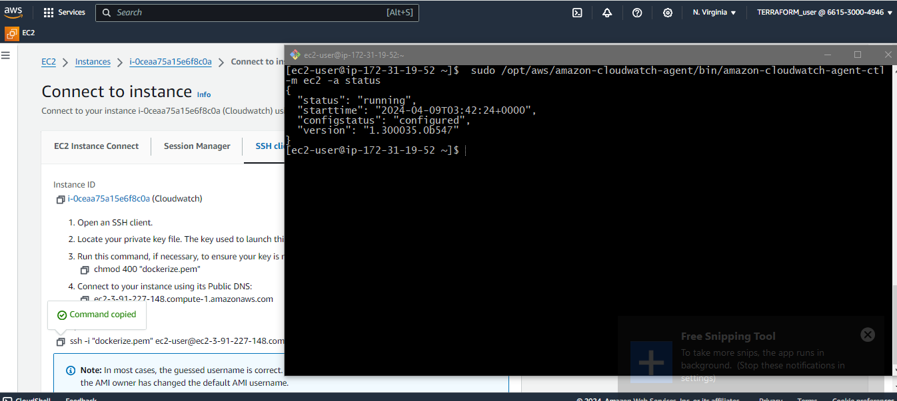


## Step 4: Monitor Your Metric In CloudWatch

Before we can monitor our EC2 instance metrics, create a new policy and attach it to our IAM role so that the role does not lack permissions to perform the ec2:Describe Tags action, which is necessary for the CloudWatch agent to retrieve EC2 instance tags.

1. Create a new Policy

In the IAM console navigation menu, click on policy and on the top right, select create policy. Follow the image below to creaet a new policy for the IAM role. Use the Json code snippet below for your policy

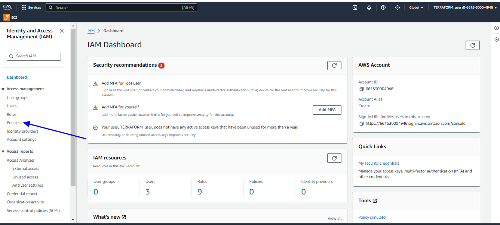

.png>)

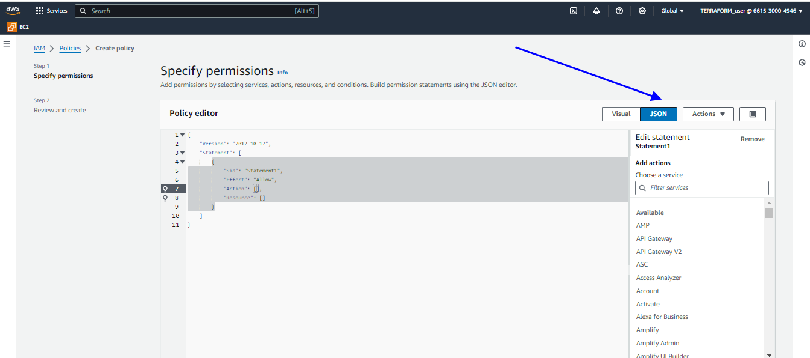

```
{
    "Version": "2012-10-17",
    "Statement": [
        {
            "Effect": "Allow",
            "Action": [
                "ec2:DescribeTags"
            ],
            "Resource": "*"
        }
    ]
}

```

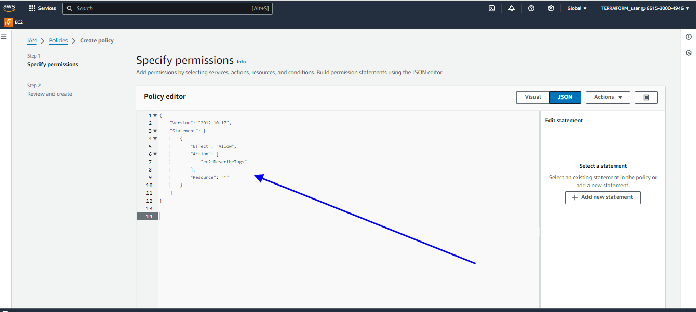

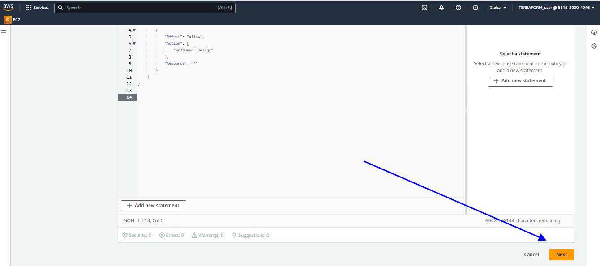

.png>)


---

2. Let's recall the parameters we created for our EC2 metric, now let's view the metric on CloudWatch console.
Navigate to the CloudWatch console. 
In the navigation menu, select all metrics.


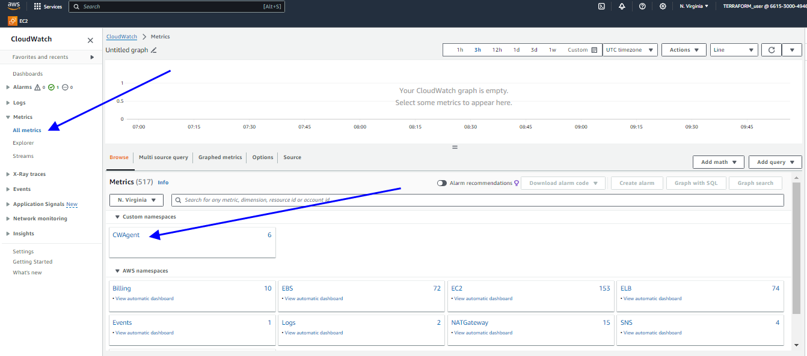

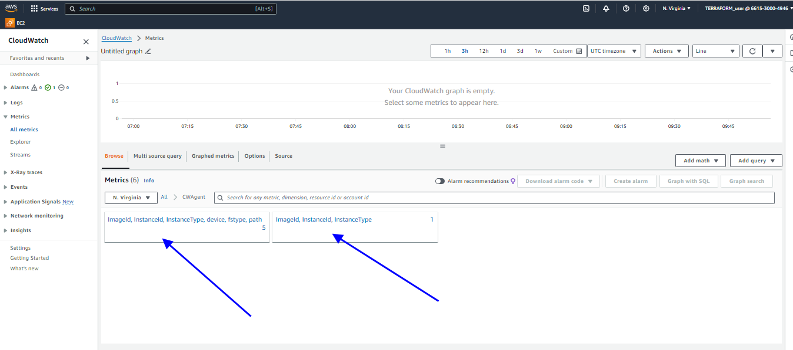

search for CWagent

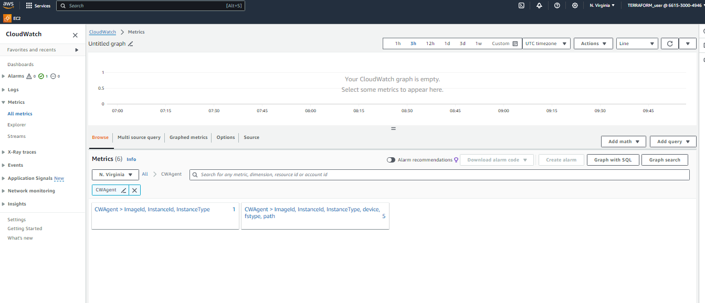


We have successfuully installed and cofigured CloudWatch to monitor your EC2 instance.

To monitor more metrics, you can go to the parameter store and edit the parameter we created then add more parameters to it. 


Follow the AWS official documentation to read more on parameters syntax for metrics
https://docs.aws.amazon.com/AmazonCloudWatch/latest/monitoring/CloudWatch-Agent-Configuration-File-Details.html

we will further explore more parameters:


- CloudWatch Metrics and Alarms

- Monitoring AWS Resources with CloudWatch

- Auditing and Analyzing with CloudTrail

- Best Practices and Integration


